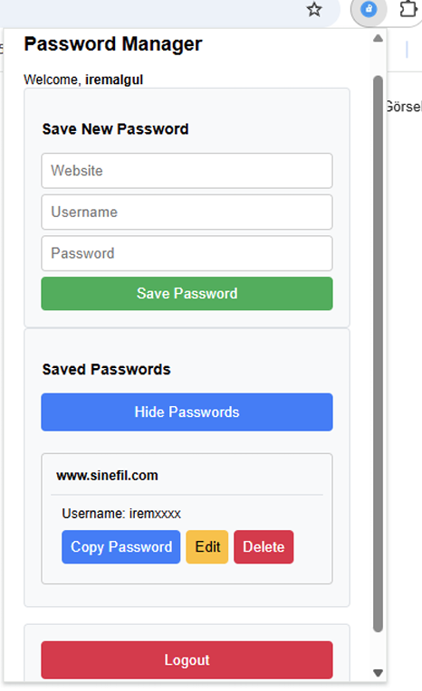

# Secure Password Manager

A secure password manager built with FastAPI and Chrome Extension integration.

## Features

- Secure password storage using AES-256-CBC encryption
- Master password protection with bcrypt hashing
- Chrome extension for easy password management
- RESTful API for secure communication
- SQLite database for local storage

## Project Structure

```
password_manager/
├── backend/
│   ├── app/
│   │   ├── api/         # API endpoints
│   │   │   ├── passwords.py  # Password management
│   │   │   └── users.py     # User management
│   │   ├── core/        # Core functionality
│   │   │   └── auth.py      # Authentication
│   │   ├── db/          # Database configuration
│   │   │   ├── database.py  # DB setup
│   │   │   └── init_db.py   # DB initialization
│   │   ├── models/      # Database models
│   │   ├── schemas/     # Pydantic schemas
│   │   ├── utils/       # Utility functions
│   │   │   └── crypto.py    # Cryptographic utilities
│   │   └── main.py      # FastAPI application
│   └── requirements.txt # Python dependencies
└── frontend/
    └── extension/       # Chrome extension files
        ├── popup.html   # Extension UI
        ├── popup.js     # UI logic
        ├── content.js   # Page interaction
        └── manifest.json # Extension config
```

## Setup

### Backend

1. Open command prompt and navigate to the project:
```bash
cd C:\Users\iremalgul\Desktop\password_manager\backend
```

2. Install dependencies:
```bash
pip install -r requirements.txt
```

3. Initialize the database:
```bash
cd app
python -m db.init_db
```

4. Start the server:
```bash
uvicorn main:app --reload
```

### Chrome Extension

1. Open Chrome and go to `chrome://extensions/`
2. Enable "Developer mode" (top right corner)
3. Click "Load unpacked"
4. Select the `frontend/extension` directory

## Security Features

- AES-256-CBC encryption for stored passwords
- bcrypt password hashing for master password
- Secure key derivation using PBKDF2
- CORS protection for API endpoints
- Secure session management

## API Documentation

Once the server is running, visit:
- Swagger UI: `http://localhost:8000/docs`
- ReDoc: `http://localhost:8000/redoc`

## Usage

1. After installation, click the extension icon in Chrome
2. Create a master password
3. Start adding and managing your passwords
4. Use the extension to automatically fill passwords on websites

## Example: Web Interface Screenshot


## Contributing

1. Fork the repository
2. Create a feature branch
3. Commit your changes
4. Push to the branch
5. Create a Pull Request 
